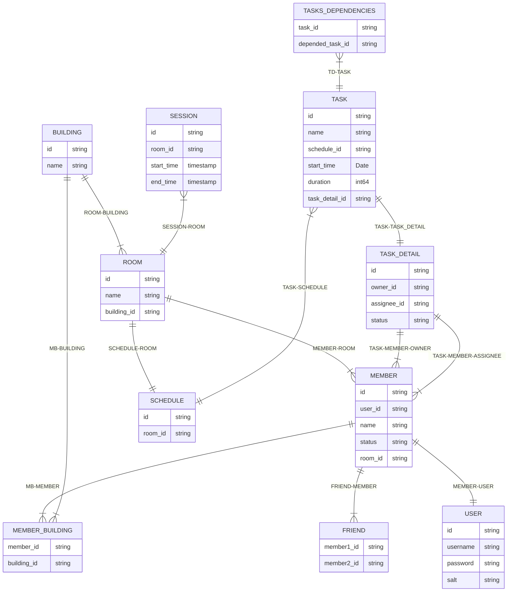

```mermaid
erDiagram
    USER {
        id string
        username string
        password string
        salt string
    }

    MEMBER {
        id string
        user_id string
        name string
        status string
        room_id string
    }


    FRIEND {
        member1_id string
        member2_id string
    }

    MEMBER ||--|| USER: MEMBER-USER
    MEMBER ||--|{ FRIEND: FRIEND-MEMBER


    BUILDING {
        id string
        name string
    }

    ROOM {
        id string
        name string
        building_id string
    }

    SESSION {
        id string
        room_id string
        start_time timestamp
        end_time timestamp
    }

    BUILDING ||--|{ ROOM: ROOM-BUILDING
    ROOM ||--|{ MEMBER: MEMBER-ROOM
    SESSION }|--|| ROOM: SESSION-ROOM

    MEMBER_BUILDING {
        member_id string
        building_id string
    }

    MEMBER ||--|{ MEMBER_BUILDING: MB-MEMBER
    BUILDING ||--|{ MEMBER_BUILDING: MB-BUILDING

    ROOM ||--|| SCHEDULE: SCHEDULE-ROOM

    SCHEDULE {
        id string
        room_id string
    }

    TASK {
        id string
        name string
        schedule_id string
        start_time Date
        duration int64
        task_detail_id string
    }

    TASKS_DEPENDENCIES {
        task_id string
        depended_task_id string
    }

    TASK_DETAIL {
        id string
        owner_id string
        assignee_id string
        status string
    }

    TASK }|--|| SCHEDULE: TASK-SCHEDULE
    TASK ||--|| TASK_DETAIL: TASK-TASK_DETAIL
    TASK_DETAIL ||--|{ MEMBER: TASK-MEMBER-OWNER
    TASK_DETAIL ||--|{ MEMBER: TASK-MEMBER-ASSIGNEE 
    TASKS_DEPENDENCIES }|--|| TASK: TD-TASK

```