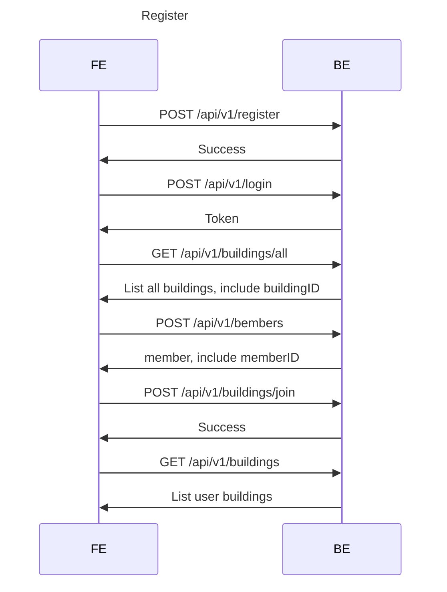
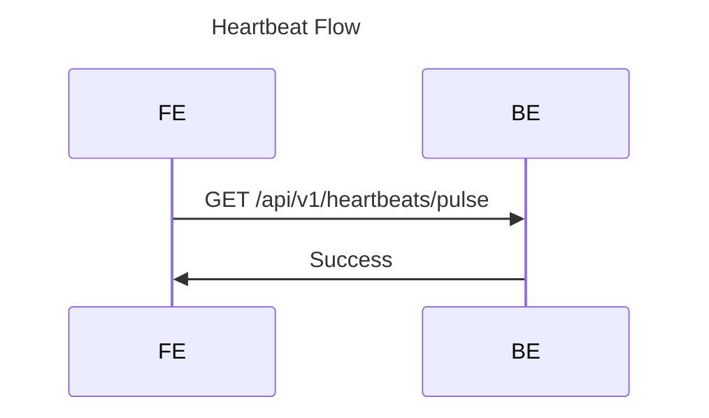

```mermaid
---
title: Register
---

sequenceDiagram
    FE->>BE: POST /api/v1/register
    BE->>FE: Success
    FE->>BE: POST /api/v1/login
    BE->>FE: Token
    FE->>BE: GET /api/v1/buildings/all
    BE->>FE: List all buildings, include buildingID
    FE->>BE: POST /api/v1/bembers
    BE->>FE: member, include memberID
    FE->>BE: POST /api/v1/buildings/join
    BE->>FE: Success
    FE->>BE: GET /api/v1/buildings
    BE->>FE: List user buildings
```

```mermaid
---
title: Heartbeat Flow
---

sequenceDiagram
    FE->>BE: GET /api/v1/heartbeats/pulse
    BE->>FE: Success
    

```