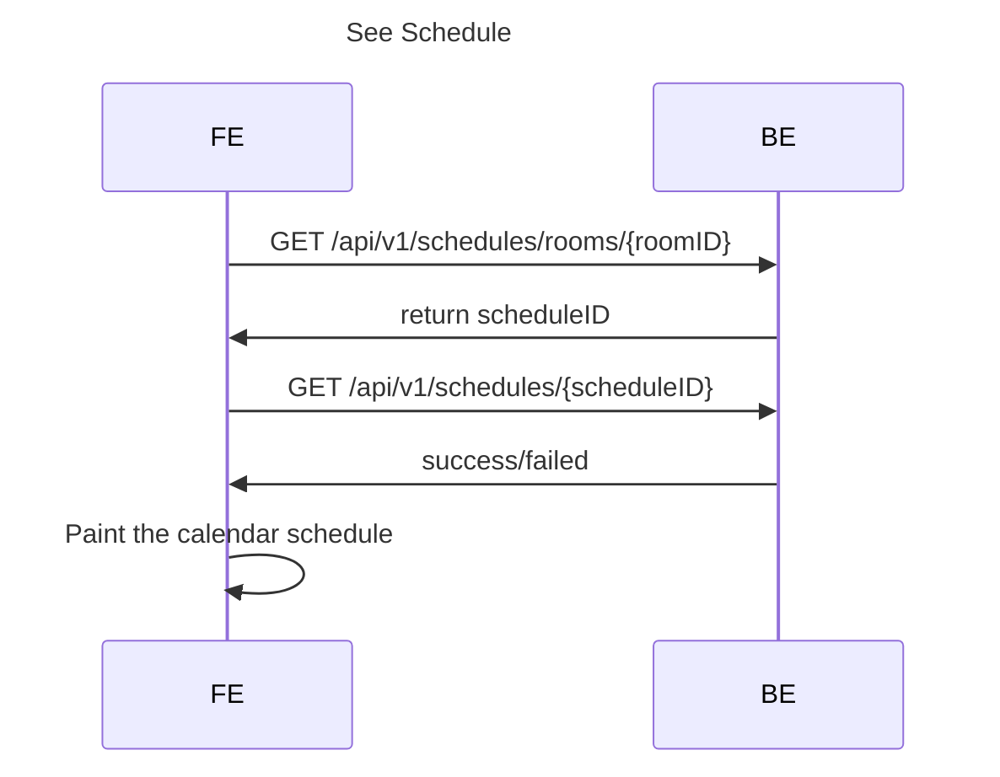
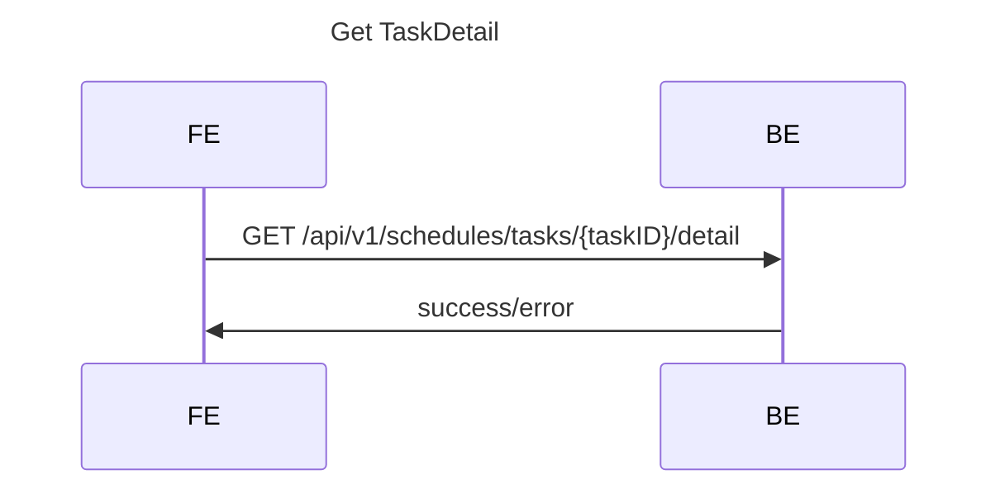
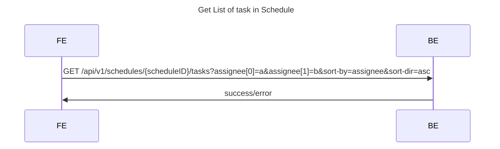
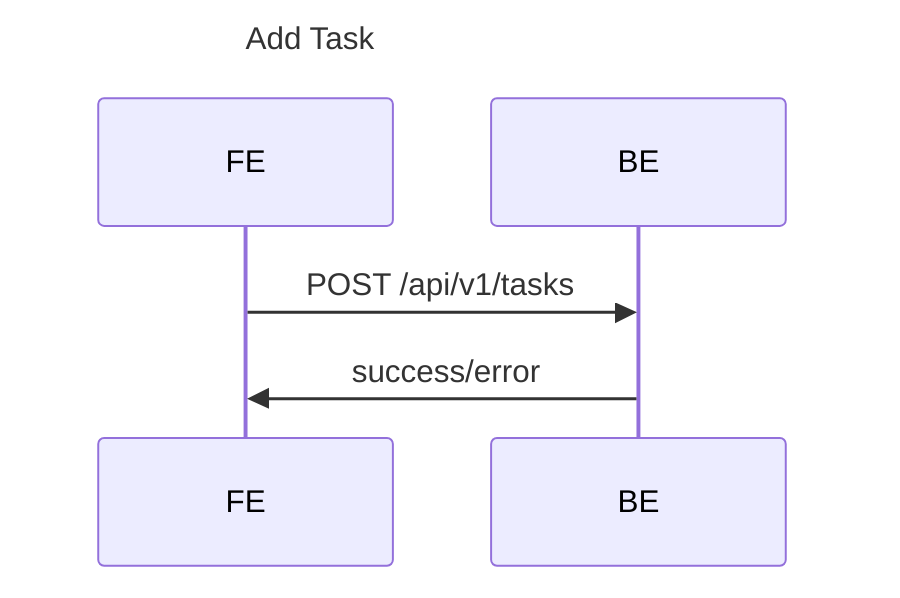
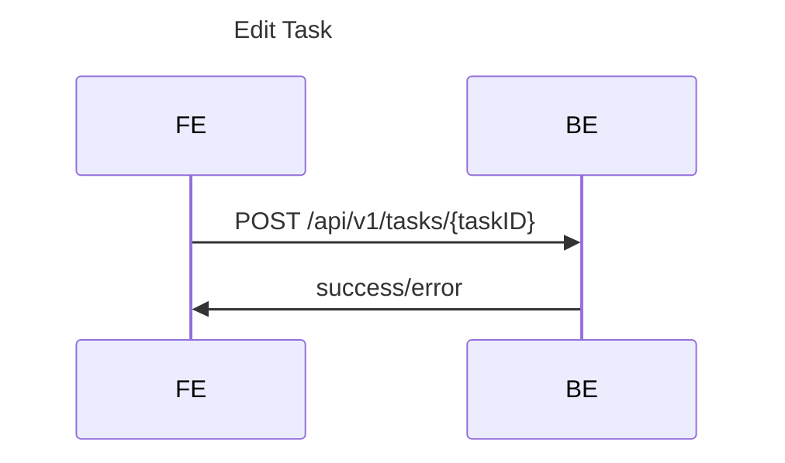
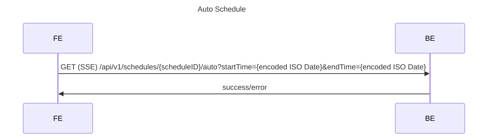

```mermaid
---
title: See Schedule
---
sequenceDiagram
    FE ->> BE: GET /api/v1/schedules/rooms/{roomID}
    BE ->> FE: return scheduleID
    FE ->> BE: GET /api/v1/schedules/{scheduleID}
    BE ->> FE: success/failed
    FE ->> FE: Paint the calendar schedule
```

```mermaid 
---
title: Get TaskDetail
---
sequenceDiagram
    FE ->> BE: GET /api/v1/schedules/tasks/{taskID}/detail
    BE ->> FE: success/error
```

```mermaid
---
title: Get List of task in Schedule
---
sequenceDiagram
    FE ->> BE: GET /api/v1/schedules/{scheduleID}/tasks?assignee[0]=a&assignee[1]=b&sort-by=assignee&sort-dir=asc
    BE ->> FE: success/error
```
## Filter
assignee=string
start-date=ISO Date
end-date=ISO Date
dependency=Array<taskID>
## Sort
sort-by=Array<assignee|owner|startDate|endDate|duration>
sort-dir=asc|dsc

```mermaid
---
title: Add Task
---
sequenceDiagram
    FE ->> BE: POST /api/v1/tasks
    BE ->> FE: success/error

```

```mermaid
---
title: Edit Task
---
sequenceDiagram
    FE ->> BE: POST /api/v1/tasks/{taskID}
    BE ->> FE: success/error

```

```mermaid
---
title: Auto Schedule
---
sequenceDiagram
    FE ->> BE: GET (SSE) /api/v1/schedules/{scheduleID}/auto?startTime={encoded ISO Date}&endTime={encoded ISO Date}
    BE ->> FE: success/error

```